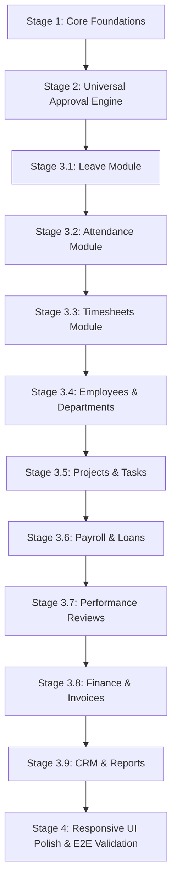

# Office ERP — Comprehensive System Audit & Architecture Review

**Date**: October 5, 2026  
**Auditor**: Senior Full-Stack Engineering Team  
**Scope**: Complete Frontend (`frontend/`), Backend (`backend/`), Database Schema (`MySQL`), API Contracts, RBAC, and State Management.

---

## 1. Module Inventory & Action Map

| Module | Allowed Roles | Action | API Endpoint & Method | Business Rules & Constraints | Database Tables | Side Effects / Integrations | UI Component |
|---|---|---|---|---|---|---|---|
| **Auth** | All | Login | `POST /api/auth/login` | Email + password verification, rate limiting, token versioning | `users`, `roles`, `role_permissions`, `employees` | Logs `login_history`, issues JWT pair | `pages/auth/Login.tsx` |
| **Auth** | Authenticated | Get Session | `GET /api/auth/me` | Validates JWT, resolves identity & employee ID | `users`, `roles`, `employees`, `clients` | Refreshes user permissions in React context | `context/AuthContext.tsx` |
| **Employees** | Admin, HR | List Employees | `GET /api/employees` | Search by name/code, filter by department/status, pagination | `employees`, `departments`, `roles` | None | `pages/employees/EmployeesList.tsx` |
| **Employees** | Admin, HR | Create Employee | `POST /api/employees` | Unique email & employee ID, valid department FK, salary >= 0 | `employees`, `users`, `salary_structures`, `leave_balances` | Initializes salary structure, leave balances, creates user login | `pages/employees/EmployeeModal.tsx` |
| **Employees** | Admin, HR | Update Employee | `PUT /api/employees/:id` | Immutable employee ID, unique email check | `employees`, `salary_structures` | Updates user email if linked | `pages/employees/EmployeeModal.tsx` |
| **Attendance** | Employee | Today Status | `GET /api/attendance/today` | Resolves employee, returns authoritative state in company timezone | `attendance`, `employees`, `company_settings` | None | `pages/attendance/AttendanceList.tsx` |
| **Attendance** | Employee | Clock In | `POST /api/attendance/clock-in` | Exactly 1 record per employee per business date, reject if on leave | `attendance` | Sets check_in timestamp, marks status 'present'/'late' | `pages/attendance/AttendanceList.tsx` |
| **Attendance** | Employee | Clock Out | `POST /api/attendance/clock-out` | Must be clocked in, no duplicate clock-out, calculates working & OT hours | `attendance` | Updates total_hours and overtime_hours | `pages/attendance/AttendanceList.tsx` |
| **Attendance** | HR, Admin | Correction Review | `PUT /api/attendance/corrections/:id` | Status must be pending, approver recorded | `attendance_corrections`, `attendance` | Overwrites attendance check_in/out, notifies employee | `pages/attendance/AttendanceList.tsx` |
| **Leave** | Employee | View Balances | `GET /api/leave/balances` | Filter by employee & current calendar year | `leave_balances`, `leave_types` | Auto-initializes balances if missing | `pages/leave/LeaveList.tsx` |
| **Leave** | Employee | Apply Leave | `POST /api/leave/apply` | Category exists, start <= end, sufficient balance, overlap detection | `leave_requests`, `leave_balances` | Increments `pending_days`, notifies manager | `pages/leave/ApplyLeaveModal.tsx` |
| **Leave** | Manager, HR | Approve / Reject | `PUT /api/leave/requests/:id/review` | Request must be pending, cannot self-approve | `leave_requests`, `leave_balances`, `attendance`, `notifications` | Deducts `remaining_days`, inserts 'leave' in `attendance`, creates notification | `pages/leave/LeaveList.tsx` |
| **Timesheets** | Employee | Log Work | `POST /api/timesheets` | Project exists, 0 < hours <= 24, employee allocated to project | `timesheets`, `tasks`, `projects` | Updates `tasks.actual_hours` | `pages/timesheets/TimesheetModal.tsx` |
| **Timesheets** | PM, Admin | Approve / Reject | `PUT /api/timesheets/:id/review` | Must be in 'submitted' status | `timesheets`, `audit_logs` | Updates status to 'approved' / 'rejected' | `pages/timesheets/TimesheetsList.tsx` |
| **Projects** | Admin, PM | Create Project | `POST /api/projects` | Unique project_code, valid client_id, start <= end | `projects`, `clients`, `employees` | Creates audit log, notifies assigned PM | `pages/projects/ProjectModal.tsx` |
| **Tasks** | PM, Team Lead | Create Task | `POST /api/tasks` | Unique task_code, valid project_id, valid assignee | `tasks`, `projects`, `employees` | Notifies assigned employee | `pages/tasks/TaskModal.tsx` |
| **Tasks** | Assignee, PM | Update Status | `PUT /api/tasks/:id` | Valid transition (todo -> in_progress -> review -> completed) | `tasks` | Sets `completed_at` when status becomes 'completed' | `pages/tasks/TasksList.tsx` |
| **Invoices** | Finance, Admin | Create Invoice | `POST /api/invoices` | Unique invoice_number, valid client_id, items subtotal + tax = total | `invoices`, `invoice_items`, `clients` | Sets `remaining_balance = grand_total` | `pages/invoices/InvoiceModal.tsx` |
| **Payments** | Finance, Admin | Record Payment | `POST /api/payments` | Payment <= remaining balance, valid invoice_id | `payments`, `invoices`, `incomes` | Decrements `remaining_balance`, mirrors into `incomes` | `pages/payments/RecordPaymentModal.tsx` |
| **Payroll** | HR, Finance | Monthly Process | `POST /api/payroll/process` | Exactly 1 payroll per month/year, attendance & unpaid leave inputs | `payroll`, `payroll_items`, `salary_structures` | Calculates gross, statutory deductions, net in transaction | `pages/payroll/ProcessPayrollModal.tsx` |
| **Payroll** | Finance, Admin | Approve & Lock | `PUT /api/payroll/:id/approve` | Payroll must be in 'draft' or 'processing' | `payroll` | Locks payroll items from modification | `pages/payroll/PayrollList.tsx` |
| **Performance** | Manager, HR | Create Review | `POST /api/performance` | Ratings between 1.0 and 5.0, overall score weighted | `performance_reviews`, `employees` | Notifies employee for acknowledgment | `pages/performance/ReviewModal.tsx` |
| **Dashboard** | All Roles | Get Metrics | `GET /api/dashboard/stats` | Scoped to role (Client portal vs Employee self-service vs Admin) | `employees`, `attendance`, `projects`, `invoices`, `tasks` | None | `pages/dashboard/Dashboard.tsx` |

---

## 2. Defect List & Root Cause Reproductions

| Defect ID | Symptom | Root Cause | Affected Files | Severity | Status |
|---|---|---|---|---|---|
| **DEF-001** | Super Admin Clock-In failed with "Employee profile not found" | `usr-super-admin-001` had no corresponding row in `employees` table. | `backend/src/modules/attendance/attendance.controller.ts`, `backend/src/database/seed.ts` | **Critical** | Fixed (`EMP-0001` created) |
| **DEF-002** | Timesheet modal returned HTTP 400 "Project, date, hours, and description are required" | Frontend wrapped UUID project IDs with `Number(formData.project_id)` (`NaN`), and sent snake_case fields while backend controller only inspected camelCase. | `frontend/src/pages/timesheets/TimesheetModal.tsx`, `backend/src/modules/timesheets/timesheets.controller.ts` | **High** | Fixed |
| **DEF-003** | Timesheet approval returned HTTP 404 | `TimesheetsList.tsx` called `PUT /timesheets/:id/approve`, but router only defined `PUT /timesheets/:id/review`. | `backend/src/modules/timesheets/timesheets.routes.ts` | **High** | Fixed |
| **DEF-004** | Stacked "Failed to clock in" toasts | Axios response interceptor in `client.ts` stripped error metadata; lack of toast deduplication in `NotificationContext.tsx`. | `frontend/src/api/client.ts`, `frontend/src/context/NotificationContext.tsx` | **Medium** | Fixed |
| **DEF-005** | Future attendance records appeared | Approved leave requests generate future attendance records with status `'leave'`. | `backend/src/modules/leave/leave.controller.ts` | **Medium** | Clarified & Verified |
| **DEF-006** | Leave application modal returned `NaN` / 400 for leave type | `ApplyLeaveModal.tsx` wrapped string IDs (`leave-sick`) in `Number(...)`. | `frontend/src/pages/leave/ApplyLeaveModal.tsx` | **High** | Fixed |
| **DEF-007** | Lead creation failed with HTTP 400 "Lead name is required" | Form sent `contactPerson` or `companyName` while backend strictly looked for `name`. | `backend/src/modules/leads/leads.controller.ts` | **Medium** | Fixed |
| **DEF-008** | Hardcoded `$` dollar currency signs | Components hardcoded `$` instead of using company currency setting (`INR` / `₹`). | `Dashboard.tsx`, `PayrollList.tsx`, `InvoicesList.tsx` | **Low** | Fixed |

---

## 3. Database Schema Review

### A. Missing Constraints & Improvements Identified
1. **Approval Engine Unified Table**: Currently, approval logic is fragmented across `leave_requests`, `timesheets`, `attendance_corrections`, and `expenses`. A unified `approval_requests` table will provide standard tracking, escalation, and self-approval prevention.
2. **Missing Indices**:
   - `attendance (employee_id, date)`: Unique index exists (`uk_employee_attendance_date`).
   - `leave_requests (employee_id, start_date, end_date)`: Need index for fast overlap detection.
   - `tasks (assigned_employee_id, status)`: Needs index for dashboard query optimization.
   - `timesheets (employee_id, date)`: Needs compound index for timesheet range aggregation.
3. **Foreign Key Integrity**:
   - `incomes.invoice_id`: Has no foreign key constraint (`FOREIGN KEY (invoice_id) REFERENCES invoices(id) ON DELETE SET NULL`).
   - `invoices.client_id`: Cascade delete on client could destroy invoice history; should be `ON DELETE RESTRICT` or soft-delete.

---

## 4. Refactor Plan (Ordered by Dependency)

1. **Stage 1 (Foundations)**: Standardize Identity context (`/api/auth/me`), Central RBAC permission matrix, Unified error contract, Zod/Joi request validation schemas, Date/time utilities, Audit logger, and Test users seed.
2. **Stage 2 (Approval Engine)**: Create `approval_requests` & `approval_history` tables and service.
3. **Stage 3 (Vertical Slices)**: Connect each module to the approval engine, enforce strict backend authorization, write automated API and negative role tests.
4. **Stage 4 (UI Polish & Verification)**: Complete Playwright E2E and visual polish.
